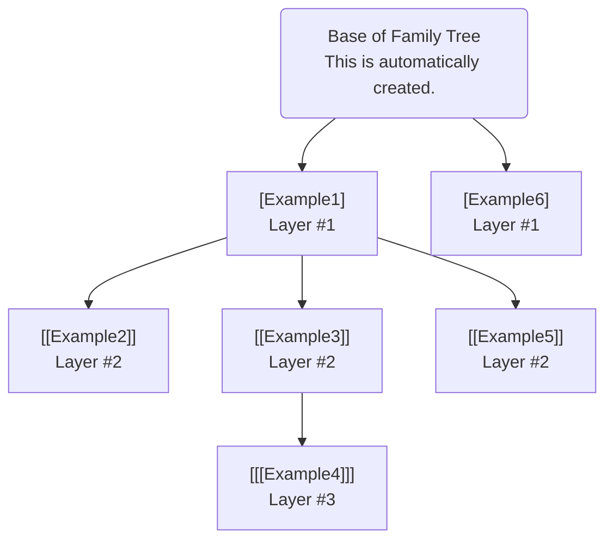

# Config files
FrogLord has a configuration file system used for many different features due to its flexibility.  
The syntax takes inspiration from the old `.ini` file-type, but is much more flexible than `.ini`.  

## Basic Example
A simple example of what a FrogLord config looks like:
```PowerShell
[SectionName1] # All of the data seen between this line and [SectionName2] is part of a section named 'SectionName1'.
key1=123 # This could be anything, ie: a number, text, etc
key2=Hello World!
Anything after the key=value section is treated as plain text, and could be interpreted by FrogLord differently based on the context.
For example, if this configuration section was being used to configure information about a mod, the text here could be treated as the mod description.

[SectionName2] # Another section
key1=456 # [SectionName2] can have its own definition of "key1" which is completely independent of the "key1" seen in [SectionName1].
```

### Sections
A **section** is used to group different lines of text together.  
In the example, there are two sections, `[SectionName1]` and `[SectionName2]`.  
The way to make sections is by coming up with the name of a section, e.g. `SectionName1`, and surrounding it with square brackets, e.g. `[SectionName1]`.  
The name to give to a section often depends on what it is used for, so refer to the other relevant documentation when choosing section names.  

> [!NOTE]
> For the purposes of this simple example, only one layer of square brackets have been used.
> However, there can be more layers of square brackets, such as `[[[Example]]]`.  
> This has a special purpose and will be explained in more detail later.

### Properties
Properties are always found at the start of a section, and are used to set specific information that FrogLord needs.  
To know which properties are available for a given type of configuration file, refer to documentation for that kind of file.  

**Examples:**  
```PowerShell
name=John
age=26
isAlive=true
```

### Text  
The first line of text in a section which does not contain the `=` equals character marks the beginning of text.  
No properties can be made once the text starts.  
How FrogLord interprets this text can differ based on what kind of configuration file is being read. Refer to the documentation of that specific file for more information.  

### Comments  
The `#` character is the comment character, meaning all text after `#` on that line will be ignored by FrogLord.
This is used to write notes for yourself and others.  

**Example:**  
```ini
Hello # All the text after the '#' character on this line will be ignored by FrogLord, so FrogLord will only see 'Hello'.
```

> [!TIP]
> To use the `#` character directly without making a comment, try escaping the value by typing `\#` instead.  

### Attaching Sections to Each other 
> [!IMPORTANT]
> Please take extra care to understand this section, as it may not be intuitive.

As described before, **sections** are used to organize different parts of a configuration file into groups.  
But it is very common to attach different sections to each other, creating something resembling a **family tree**.  
When creating a section, the way to choose where to attach it is by choosing the number of square brackets (`[` and `]`) to surround the section name with.
This is called the "layer". So for example, `[Example]` is considered to be on layer one, but `[[[Example]]]` is considered to be on layer three.  
In order to specify which section to attach a new section to, use one more layer of square brackets than the section you'd like to attach to.  
Please refer to the example to understand how this works in practice.  

**Example (Think of it like a family tree):**  


The above diagram corresponds exactly to the following text:
```PowerShell
[Example1]

[[Example2]] # This section has two square braces, meaning it is attached to [Example1].

[[Example3]] # This section has two square braces, meaning it is also attached to [Example1], NOT [[Example2]].

[[[Example4]]] # This section has three square braces, meaning it is attached to the most recent section on layer two, which is [[Example3]].

[[Example5]] # This section also has two square braces, meaning it is attached to [Example1].

[Example6] # This section is not attached to any other section because there is no such thing as a section with zero square brackets.  
```