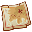
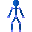
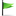

# Game Files (Frogger: The Great Quest)
Frogger: The Great Quest contains only 4 main file types:
 - Image Files (.img)
 - Sound Banks (.sbr)
 - 3D Models (.vtx)
 - Chunked Files (.dat, Maps & Data)

## Image Files (.img)
Image files contain all image data for the game including textures for 3D models, and 2D menu elements.  
They are capable of containing transparent pixels.

**How to import/export manually:**  
Select an image in the main file list, and click either the "Export" or "Import" button.  
Please note that the image file names in chunked files are only references to the real .img files found in the main file list, and cannot be directly imported/exported.

**How to import/export in a mod:**  
This feature is currently under development.

**Pixel Formats (Optional):**  
FrogLord will automatically convert imported images to the best available image pixel format based on the following criteria.  
So when making large mods, reference the following table to ensure your images don't get too large.

| Name     | Bits Per Pixel | When is it used                                   |
|----------|----------------|---------------------------------------------------|
| INDEXED8 | 8              | If there are no more than 256 colors used.        |
| R8G8B8   | 24             | If there's at least one pixel which isn't opaque. |
| A8R8G8B8 | 32             | When there are no other formats are available.    |

## Sound Banks (.sbr)
Sound Banks contain all game sound effects.
Every single level (and the main menu) have their own .SBR files, labelled between `00.SBR` and `18.SBR`.  

**Difference between "Entry" and "Wave":**
FrogLord has a drop-down menu to show both "Entries" and "Waves".  
"Waves" are the actual sound files (think .wav) inside of the .SBR files.
"Entries" contain information about the sound files (like if they are music, what volume to play them at, etc.)

Entries are also able to reference sounds found in the .SCK file (see below for more info.).

**How can I export/change sounds in FrogLord?**  
TODO: Explain

**How can I export/change sounds in a mod I plan to share?**  
TODO: This feature is still in progress. Check back later!

**PC Version Limitation:**  
FrogLord is unable to play original sound effects from the PC version .SBR files due to using an unsupported audio format.  
This limitation does not apply to the PS2 version, nor will it necessarily apply to many of the sounds imported for mods.  
This is okay, and the game will still save properly if the .wav file is valid, even if FrogLord can't play your imported audio.  
The .SCK file is not impacted by this limitation.  

**The Special .SCK File:**  
In addition to the .SBR files for each level, there is one .SCK file.  
There is a key difference between the .SBR files and the .SCK file because the .SBR files are kept fully loaded in memory.
It is very easy to run out of memory by adding sounds to the .SBR files, so for large audio files (such as music, voice clips, etc), they should be added to the .SCK file instead of the .SBR file.
The .SCK file is special because it has "streamed audio", meaning sound files are streamed from CD as they are played, much like a CD player.  
This means that the full sound doesn't need to be loaded in memory, thus saving memory.  

To play a sound file present in the .SCK file, there **MUST** be a corresponding entry in the level's .SBR file.  

## 3D Models (.vtx)

**How to view?**
Select them from the main file list, then click the "View" button.
Please note that the ".vtx" entries inside chunked files are NOT the models themselves, but just references to them.

**How to export 3D models to .obj?**
Right now it is only possible to export the models to .obj in bulk.
Select `File > Export Files`, and choose the folder you'd like game files to be exported to.

**Where are the animations?**  
The animations are kept separate from the models themselves, and are only in the chunked files.  
Refer to the chunked file documentation below for more information.

**How can I import my own 3D models?**
This feature is not yet supported :(

## Chunked Files (.dat, Maps & Data)
Chunked files are how the game loads data for a particular stage.
On the main menu for example, the game will load `00.dat`.  
Then, when it is time to load Rolling Rapids Creek, the game will load `01.dat`, which contains the data for the first level.  
So these files contain many different types of other resources inside of them.  

These resource chunks can be viewed by selecting a chunked file from the main file list.  
FrogLord allows adding/removing/editing individual chunks in the editor, but the recommended way to edit them (for making mods) is with [.gqs files](./scripting.md).  

### Resource Chunk Types
Information on how to edit the various resource chunk types can be found in the [GQS file documentation](./modding-gqs-file.md) instead.  

###  Raw Data (ID: 1)
Raw data is data with a less rigid structure, but in reality it's only used for the `kcEnvironment` (level lighting data) and `scriptdata` (a chunk containing all scripts for the level).

###  Texture Reference (ID: 2)
A texture reference tells the game to load a particular texture while on the loading screen.
The full file path of the image is included.

###  OctTreeSceneMgr (ID: 3)
The OctTreeSceneMgr contains all 3D scene data, both visual 3D meshes and the hidden collision mesh.  
It's broken up into an "Octree", which is just a fancy way of making it fast to figure out which parts of the world to render/skip.  
Double-click the OctTreeSceneMgr, or the chunked file itself to open the 3D view of the level.  

###  Model Reference (ID: 4)
A model reference tells the game to load a particular 3D model while on the loading screen.
The full file path of the model is included.

###  Animation Track (ID: 6)
Animation Tracks (.bae files) contain a single (but full) 3D animation for a 3D model.  
There is no current way to import/export 3D model animations, but they can be viewed through the ActorDesc data.

###  Animation Skeleton/Hierarchy (ID: 7)
Animation Hierarchies/Skeletons (.bhe files) are the 3D rig/skeleton used when animating a 3D model.  
There is no current way to import/export 3D model animations, but they can be viewed through the ActorDesc data.

###  Animation Set (ID: 8)
These are unused by the base game, but contain a list of all animations usable by a particular 3D model.  
FrogLord relies on these despite the game leaving them unused, because FrogLord uses them to know which animations can be used with a particular 3D model.  

###  Collision Triangle Mesh (ID: 10)
Collision Triangle Meshes (.ctm files) contain 3D meshes used for testing collision on different 3D models.  
FrogLord is currently only able to preview these files when previewing a level.

###  Generic Data Section (ID: 12)
Much like the `Raw Data` resource type, `Generic Data` can contain many different types of data, as follows:  

####  Actor Description (Generic Data Type)
An actor description is a template containing the settings used to create an actor entity.  
TODO: Detail the FrogLord config syntax for creating these.  

####  Emitter Description (Generic Data Type)
An actor description is a template containing the settings used to create a particle emitter entity.  
TODO: Detail the FrogLord config syntax for creating these.

####  Item Description (Generic Data Type)
An actor description is a template containing the settings used to create an item entity. (Coins/gems/keys/etc)  
TODO: Detail the FrogLord config syntax for creating these.

####  Launcher Description (Generic Data Type)
An actor description is a template containing the settings used to create a projectile launcher (Goobers, Fireballs, spells, etc.)  
TODO: Detail the FrogLord config syntax for creating these.  

####  Model Description (Generic Data Type)
This is mostly pointless, it's just an extra 3D model used in addition to the `Model Reference` chunk type.  

####  Particle Emitter Param (Generic Data Type)
Contains information about the particles created by a Particle Emitter entity.
TODO: Detail the FrogLord config syntax for creating these.

####  Prop Description (Generic Data Type)
An actor description is a template containing the settings used to create a prop entity (Chairs, mushrooms, doors, treasure chests, etc.)  
TODO: Detail the FrogLord config syntax for creating these.

####  Proxy Capsule Description (Generic Data Type)
Defines an invisible 3D pill-shaped capsule which can be used for entity collision.  
TODO: Include the FrogLord syntax for creating these.  

####  Proxy Tri Mesh Description (Generic Data Type)
Defines an invisible 3D mesh which can be used for entity collision.  
TODO: Include the FrogLord syntax for creating these.

####  Resource Path (Generic Data Type)
These appear to be unused (may have been used by the debug version of the game), and declare the full file paths where the `Animation Tracks` were originally imported from.  
Modders can ignore these resources as they are unused.

####  String Resource (Generic Data Type)
String resources contain the text shown in various dialog boxes throughout the game.  

####  Waypoint Description (Generic Data Type)
An actor description is a template containing the settings used to create a waypoint entity.  
Waypoint entities are invisible, and are primarily used in scripts for purposes ranging from pathfinding to checking when an entity enters/exits a certain part of the world.  
TODO: Detail the FrogLord config syntax for creating these.

###  Action Sequence (ID: 13)
Action Sequences are special kinds of [kcScript](./scripting.md) which have a special set of script effects/actions available.  
Each entity can have only one Action Sequence active at a time, and they often control entity 3D model animations.  
The "Action Sequence Names" resource is automatically updated to include Action Sequences when they are added/removed.  
The AI system responsible for pathfinding/walking/enemy attacks/etc will replace the current action sequence with one of its choosing (based on the sequence name) when an entity changes its current action.  
Because of this, it is important to use the original naming conventions for any new action sequences that the AI system should use.  

###  Action Sequence Names (ID: 14)
Action Sequences are a bit special, in that their hashes (See the [GQS documentation](./modding-gqs-file.md) for more info)) appear randomly generated instead of based on their name.  
Because of this, there needs to be a way to figure out which Action Sequences correspond to which Action Sequence name.  
This resource serves that purpose, and FrogLord will automatically update it when action sequences are added/removed.  

###  Entity Instance (ID: 15)
Every single enemy/ally/character, coin/item, and 3D model is an entity.
These entity instances are the definitions of where the entity should be placed in the world, if it has a script active, and other configuration data.  
TODO: Detail the FrogLord config syntax for creating these.

## FAQ
### How can I add/delete files from the game?
This functionality is not officially supported yet, even if Noodle is capable of doing it.  
Please wait for a future release before using this capability in mods.
