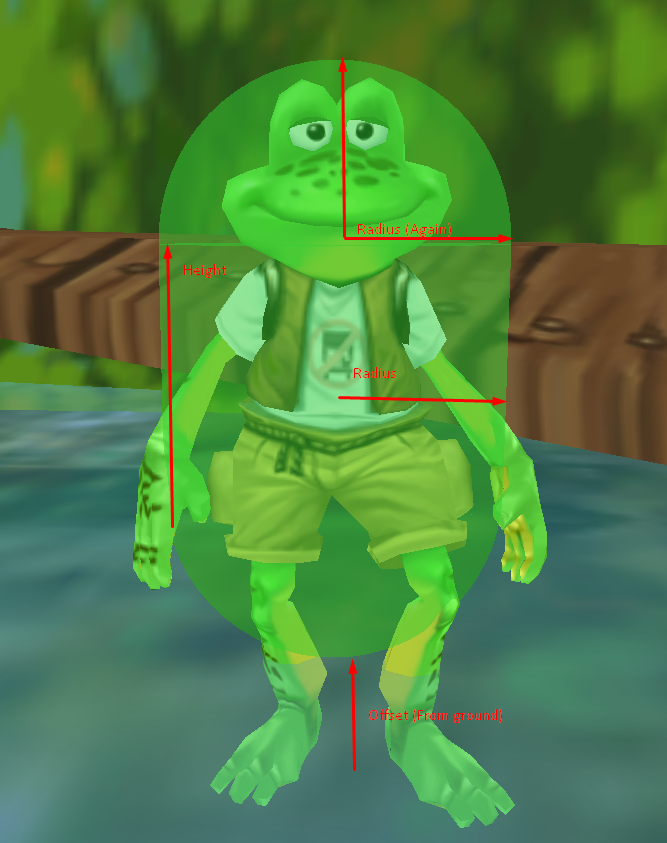

# Great Quest Script (.GQS Files)
Chunked files in Frogger: The Great Quest contain all the various data chunks loaded for a scene at any given time (such as level or menu screen).  
Note that these files are not the same thing as a **kcScript**, even though **kcScripts** can be included in `.gqs` files.  
GQS files are a special FrogLord format which detail the changes applied to a chunked file in order to install the mod.

## Before Starting
In order to understand how `.gqs` configuration files work, make sure to read about [FrogLord configuration files](../../froglord/config-files.md).  

## Getting Started
The recommended editor to use for `.gqs` files is [Visual Studio Code](https://code.visualstudio.com/download), however any text editor such as [Notepad++](https://notepad-plus-plus.org/downloads/) will work as well.  
While using Visual Studio Code, it is recommended to set the syntax highlighting to either `Shell` with the `Configure File Association for 'gqs'` option when clicking on the file type in the bottom-right hand corner of the UI.  
While using Notepad++, it is recommended to set the syntax highlighting to either `Shell` or `PowerShell` with the `Language > ...` menu, to color the scripts.  

## Applying GQS Files Manually
In FrogLord:
1. Locate the level you want to modify in the file viewer on the left-side of FrogLord.
2. Right-click the level.
3. Choose "Import GQS" and select the desired `.gqs` file.
4. Check for warnings shown by FrogLord.
FrogLord will import the GQS file. If FrogLord reports any warnings, make sure to read them, as they often indicate real issues.  
The original game can often trip these warning messages, so if a warning is from the original game, it may be okay to ignore.  

## How to use GQS files in Noodle?
TODO: Include some information on how to manage scripts with Noodle later.

## GQS Sections
The following sections document each of the available GQS config sections which are available, how they work, and how to configure them.  

### Quick Sections Reference
- `[Models]`             – Configures 3D models and descriptions
- `[Textures]`           – Configures textures and descriptions
- `[SoundEffects]`       – Adds references to streamed sound effects in `.SCK`
- `[CopyResources]`      – Copies resources from one `.dat` to another
- `[DeleteResources]`    – Deletes chunks from current level
- `[Animations]`         – Adds animations to Animation Set
- `[Sequences]`          – Creates/replaces Action Sequences
- `[Dialog]`             – Creates/replaces dialog strings
- `[Collision]`          – Creates/updates collision proxies
- `[Launchers]`          – Creates/updates launcher templates
- `[EntityDescriptions]` – Creates/updates entity templates (Actor, Prop, Item, etc.)
- `[Entities]`           – Creates/updates Entity Instances
- `[Scripts]`            – Adds scripts to existing entities
- `[Include]`            – Loads other gqs files

### [Models]
Including 3D model requires three separate pieces.  
1) Importing the .VTX file into the `data.bin` file. (Skip if the .VTX is already part of the game.)  
2) Creating a "model reference". (This is done by adding the file name under `[Models]`)
3) Creating a "model description" (Use `--CreateModelDesc <modelDescName>`, skip for WATER and DOME meshes.)

Example:  
```PowerShell
[Models]
# These models already exist within the game, so they only need to follow steps 2 and 3.
\GameSource\Level00Global\Characters\C036\C036.VTX --CreateModelDesc "GeneralModelDesc" # The Magical General
\GameSource\Level00Global\Characters\C058\C058.vtx --CreateModelDesc "Princess JoyModelDesc" # Princess Joy

# Sky Box
# There's no need to include --CreateModelDesc, because Sky domes are not entities.
# Therefore, only step 2 needs to be followed.
\GameSource\Level17JoyCastle\Level\17DOME.VTX
```

### [Textures]
Configuring textures can be broken down into two steps.  
1) Creating a "texture reference" by putting the desired image file path into the `[Textures]` section.  
2) Importing the image into `data.bin` by using `--Import <filePath>`. (Optional.)  

Example:
```PowerShell
[Textures]
# Creates a texture reference (resource chunk named 'bee.img') in the level chunked file.
# This will ensure the image is loaded while on the loading screen, but will keep the original image unmodified.
\GameSource\Level02BogTown\Level\bee.img

# Replaces an existing image (catwlk01.img) with a new one.
\GameSource\Level02BogTown\Level\catwlk01.img --Import "../images/phroi_cult_poster.png"

# Creates a new image (phroi_cult.img), based on the same image path as above.
\GameSource\Level02BogTown\Level\phroi_cult.img --Import "../images/phroi_cult_poster.png"
```

#### Texture Options
**--Import <filePath>:**  
Example: `--Import "../images/phroi_cult_poster.png"`  
Creates or replaces the image in `data.bin` with the image found at the given path (relative to the .gqs file.)  
Most common image formats (`.bmp`, `.png`, `.gif`, `.jpg`, etc.) should be supported, but different computers may have different formats available.  

**--Resize \<width>x\<height>:**  
Example: `--Resize 128x128`  
Resizes the image to the newly given width/height using nearest neighbor scaling (to keep existing palette).  

**--Delete:**  
Deletes the image from `data.bin`, and the texture reference in the level.  

### [SoundEffects]
Allows importing/configuring sound files.  
Each line starts with the sound identifier (path).  
This will allow such a sound effect to be used in the current level.

Example:
```PowerShell
[SoundEffects]
characters/MagicalGeneral/hurt0
characters/Phroi/lvl04_sick_response
characters/Phroi/lvl08_dialog_07
characters/Phroi/lvl10_dialog_04
```

Then, the following flags can be included to configure the sound.  
All the following flags are considered optional, but not including `--Music`, `--VoiceClip`, or `--Repeat` will clear those properties if they were previously present.  

**--Music:**  
Marks the sound as being music.  
Not sure what this is actually used for.  

> [!NOTE]  
> Always include `--Priority 200` with `--Music` to ensure the game properly identifies the sound as music.  

**--VoiceClip:**  
Marks the sound as a voice clip.  
Not sure what this is actually used for.  

**--Repeat:**  
Marks the sound as repeating when it ends.  
This must be used with a `--Priority` of 200 or higher (in the case of a streamed sound), or it will not repeat.  
<!-- kcCSoundEffectStream::Play is why it won't repeat. -->  

**--Priority \<newPriority\>:**  
Higher priority sounds will stop/replace lower priority sounds.  
Having a priority of 200 means the (streamed) sound will not be stopped when dialog is advanced.  
Valid Range: `0-255`  (100 is the default priority.)  

<details>
  <summary>Detailed information for programmers.</summary>

When either `kcCAudioManager::PlaySfx` or `kcCAudioManager::OpenSfx` play a streamed sound effect, they will either update the globally tracked "music handle" or "voice handle".  
The music handle is unused, but the voice handle is stopped whenever a dialog box is advanced. (By `kcCDialog::Update`)  
So, if a sound should not be stopped when dialog is advanced, use `--Priority 200`.  
A priority of 200 will cause the "music handle" to be set instead of the "voice handle".  
</details>

**--Volume \<newVolume\>:**  
Choose the volume at which the sound is played back at.  
Valid Range: `0-127` (127 is the default volume)  

**--Pan \<newPan\>:**  
Sets the audio pan of the sound. (How strongly to play the sound in each ear.)  
Valid Range: `0-127` (64 is the default pan)  
Only usable on streamed sounds (not embedded).  

**--Pitch \<newPitch\>:**  
Sets the pitch which the sound is played back with.  
Valid Range: `0-127` (0 is the default pitch)  
Only usable on streamed sounds (not embedded).  

**--SampleRate \<newSampleRate\>:**  
Re-encode the sound with the new sample-rate.  
Common Values: `11025, 22050, 24000, 48000`  

**--BitDepth \<newBitDepth\>:**  
Re-encode the sound with the new bit-depth.  
Valid Values: `8, 16, 24, 32`

> [!WARNING]  
> PlayStation 2 builds of the game only support 16-bit embedded sounds, while `--BitDepth` can still be used, the audio file will then be converted to 16-bit.  

**--ChannelCount \<newChannelCount\>:**  
Re-encode the sound with the new number of channels.  
Valid Values: `1, 2`  

> [!WARNING]  
> PlayStation 2 builds of the game only support mono embedded sounds, while `--Channel` can still be used, the audio file will then be converted to mono.  

**--Embedded:**  
Embeds the sound into the per-level .SBR file.  

> [!NOTE]  
> It is possible to play many (up to 64) embedded sounds at the same time, without interrupting the streamed audio.  
> This is the main benefit compared to streamed audio, which can only play two at a time (and one of those slots is taken up by music!).  

> [!WARNING]  
> If the .SBR file reaches/exceeds 1MB, the game will crash when loaded!  
> Use streamed audio when possible, and lower the quality of embedded audio.

**--Stream:**  
Moves the sound from the per-level .SBR file to the `SNDCHUNK.SCK` file.  

> [!NOTE]  
> All sounds except short sound effects should be streamed audio because of the 1MB limit on .SBR files.  
> Unfortunately, there is a downside, which is that only two streamed sounds can be played at the same time.  
> Because music is always playing, that means only one streamed sound file can be played at a time.  
> Usually, new sound effects will stop the previous sound effect and play over them.

**--Import \<relativeFilePath\>:**  
Imports a .wav file from a file path relative to the .gqs file.  
If neither `--Stream` or `--Embedded` are included, the sound will either use the pre-existing sound type, or create a new streamed sound.  

**--Delete**  
Removes the sound from the level.

### [CopyResources]
Copies resource chunks from one chunked file to the chunked file which the .gqs file is applied to.  

Example:
```PowerShell
# The following resources are copied from Fairy Town Spring to the current level.
[CopyResources]
[[\GameData\Level06FairyTownSpring\Level\06.dat]]
C054.bhe
C054-1AnimSet
Holly{seqs}
C054NrmIdle01.bae
Holly[NrmIdle01] # Idle pose
C054FlyIdle01.bae
0xA4B8D667 # Holly[FlyIdle01] Flying idle pose <--- This line contains an example of a raw hash. See the bottom of this document for more information.
C054NrmReac01.bae
Holly[NrmReac01] # Flinch and cover
```

### [DeleteResources]
Deletes resource chunks from the chunked file which the .gqs file is applied to.  

Example:
```PowerShell
# Any resource chunk in the target chunk file could be deleted here, not just entity instances as shown here.
[DeleteResources]
CrateInst005 # Unnecessary; replaced by CrateInst002
CrateInst006 # Unnecessary; replaced by CrateInst003
CrateInst007 # Unnecessary; replaced by CrateInst004
FrogmotherInst002 # Unnecessary; utilizing FrogmotherInst001
FrogmotherInst003 # Unnecessary; utilizing FrogmotherInst001
FrogmotherInst004 # Unnecessary; utilizing FrogmotherInst001
```

### [Animations]
Add animation files to the given `Animation Set`.

Example:
```PowerShell
[Animations]
[[C002-1AnimSet]] # The animation set to add animations to.
C002FlyDodg01.bae
```

### [Sequences]
Action Sequences are special kinds of [kcScript](./scripting.md) which have a special set of script effects/actions available.  
Their primary use is managing entity animations, especially in the context of AI actions, like attacking, reacting to an attack, etc.  
Each entity can have only one Action Sequence active at a time, and they often control entity 3D model animations.  
The "Action Sequence Names" resource is automatically updated to include Action Sequences when they are added/removed.  
The AI system responsible for pathfinding/walking/enemy attacks/etc will replace the current action sequence with one of its choosing (based on the sequence name) when an entity changes its current action.  
Because of this, it is important to use the original naming conventions for any new action sequences that the AI system should use.  
Refer [here](./modding-gqs-file.md#sequences) for more information.
See the [scripting documentation](./scripting.md) for in-depth information on writing scripts.  

Example:
```PowerShell
[Sequences]
[[Frog]] # The Action Sequence name prefix.
[[[WaveAtGeneral]]] # The name of the action sequence. (FrogLord will create one named 'Frog[WaveAtGeneral]' when combining the name prefix)
# Beyond this line is the action sequence script. See the scripting documentation for more information.
SetAnimation "C001NRMCONV10.BAE" 0.1 --FirstInSequence
WaitForAnimation
SetAnimation "C001NRMCONV10.BAE" 0.1
WaitForAnimation
SetAnimation "C001NrmIdle01.bae" 0.2 --Repeat
```

#### How does the AI work with action sequences?
Character entities with their AI enabled will often automatically select their sequence based on what they are doing, and the available sequence names.  
Eg: When creating action sequences, the name of the sequence matters.  
<!-- MonsterClass::TransitionTo is responsible for building these names. -->
To create the name of a sequence, pick the text from each step, then smooth them all together to get your name:
1) Select `Nrm` (Normal), `Fly` (Flyer), or `Swm` (Swimmer), based on the character's type.
2) Select one of the following options: `None`, `Idle`, `Walk`, `Run`, `Atk` (Attack), `Tnt` (Taunt), `Reac` (React), `Rng` (Range), `Spel` (Spell), `Die`, `Slp` (Sleep), `Talk`, `Spc` (Special?)
3) Then, add `01`, `02`, `03`, etc, depending on how many other animations you've added with the name so far.
4) Optionally, add `Agg` to the end, if you want it to be the aggressive variant.

So, if I were to get Frogger's 1st walking animation, I would get `NrmWalk01`.  
All that would be necessary to make Frogger animate while walking would be to create an action sequence named `NrmWalk01` for Frogger.

### [Dialog]
Add/replace `String Resources` (dialog strings) so they can be used in scripts.

Example:
```PowerShell
[Dialog]
WEDDING_BUMBLY_001="Bumbly Dumbly: Go to wedding! :]"
WEDDING_HOLLY_001="Princess Holly: Frogger, over here!"
WEDDING_HOLLY_002="Princess Holly: Please help my sister, I left as soon as I could, but I'm too late."
WEDDING_HOLLY_003="Princess Holly: I find myself unable to do anything without alerting Phroi, who followed me from Fairy Town..."
WEDDING_HOLLY_004="Princess Holly: Since I now know his true identity, I have no doubt he would try to stop me, but perhaps he wouldn't do the same to you."
WEDDING_FROGGER_001="Frogger: Gotcha."
WEDDING_HOLLY_005="Princess Holly: Can you find out what he's planning?"
WEDDING_FROGGER_002="Frogger: Well, ok, I'll try!"
```

### [Collision]
Collision happens through what are called "collision proxies", which are stand-ins for objects (terrain, entities, etc.)  
These proxies are 3D shapes which aren't shown in-game, but can be previewed using FrogLord.  
There are two kinds of proxies, "capsules" and "triangle meshes".


**Capsules (kcCProxyCapsule):**  
A "proxy capsule" is a pill-shaped area (a cylinder with a round top/bottom). These are very easy to create, and fast for the game engine to use, but not very precise.  

**Example:**  
```PowerShell
[Collision]
[[HollyProxyDesc]] # The name of the collision proxy is 'HollyProxyDesc'.
type=CAPSULE # This is a capsule.
reaction=SLIDE # Colliding entities should slide off. Other reactions are: PENETRATE (let the user through), and HALT (stop all movement).
collisionGroups=NonHostileEntities # This collision proxy belongs to the NonHostileEntities collision group.
collideWith=TriangleMeshes, Player, NonHostileEntities, HostileEntities, Terrain # These groups can collide with this collision proxy.
radius=0.35 # The radius of the cylinder/hemisphere/pill shapes.
height=0.7 # The height between the top and bottom hemispheres.
offset=0.2 # How far up from the entity's Y position should the pill be offset to.
```

<details>
  <summary>Click here to see an example collision proxy.</summary>


</details>

**Triangle Meshes (kcCProxyTriMesh):**  
A "triangle mesh" is a just a normal 3D model, but without any textures.
These are more flexible than capsules but do not perform very well.  
Note that these cannot have animations like the models which get displayed in-game can.

TODO: Creating through configurations.
TODO: Flesh out the instructions for creating collision proxies.

#### There's more to collision though!  
Before the proxy will be tested, there is a sphere on every actor description.    
This sphere is a very fast collision test which gets checked BEFORE the proxies are tested.  
This is because spheres are extremely fast/quick/easy to check, so the sphere can eliminate some of the more heavy collision checks.  
So, make sure the entity description's collision sphere is large enough to hold the full collision shape!  
To check this, open the map 3D preview in FrogLord, and check that the blue collision sphere fully contains the green collision proxy.

#### Collision Groups  
The game groups together certain similar entities so that collision which should be skipped can be skipped quickly.  
For example, enemies don't need to collide with coins/gems/etc, but they do need to collide with the player.  
So each entity description has a "collisionGroup" field to indicate what group(s) it is part of, as well as a "collideWith" field to indicate which collision groups the entity should collide with.  
The following are the collision groups which can be used:
```properties
TriangleMeshes # 00
Player # 01
NonHostileEntities # 02
HostileEntities # 03
PlayerKicks # 04 (The player's feet while they are kicking)
PlayerPunches # 05 (The player's hands while they are punching)
Flyers # 11
Swimmers # 12
Sensors # 14 (Attack / Bump Sensors)
Items # 15
Terrain # 16
Climbable # 31, Seems to be set on climbable models such as ladders and vines.
# There are a ton more possible collision groups than the ones listed above, but most are unused.
# Thus, they are free to be used for whatever kind of purpose the mod-creator likes.
# To specify one of the unused collision groups, use the following:
UnnamedGroupXX # Where XX is a number between 0 and 31 and is not one of the numbers listed above. For example: UnnamedGroup17
```

### [Launchers]
This section can be used to create/update projectile launchers.
```PowerShell
[Launchers]
[[{entity name}LauncherDesc]] # Replace {entity name} with the name of the entity.

TODO: We haven't put the things from kcParticleParam here yet!!!

# The name of the 3D model reference to use for the projectile. (Optional)
projectileModel=...

# The particle effect reference to display while the projectile is in the air. (Optional)
cruiseParticleEffect=...

# The particle effect reference to display when the projectile hits something. (Optional)
hitParticleEffect=...

# How long the projectile will last for (in seconds)
projectileLifeTime=2.5

# How fast the projectile will move. (Units unknown)
projectileSpeed=10.0
```

### [EntityDescriptions]
This section can be used to create/update any kind of entity description (Actor descriptions, Prop descriptions, Item descriptions, etc.)  
Check out the [game file documentation](./modding-game-files.md#-actor-description-generic-data-type) for details on each available description type.  

Example:
```PowerShell
[EntityDescriptions]
[[Wedding WaypointWayptDesc]]
type=WAYPOINT
flags=HideShadow
boundingSpherePos=0.0, 0.0, 0.0
boundingSphereRadius=1.0
waypointType=BOUNDING_BOX
prevWaypoint=0xFFFFFFFF
nextWaypoint=0xFFFFFFFF
boundingBoxDimensions=10.0, 13.0, 14.0
```

### [Entities]
This section is used to create & update `Entity Instances`.  
Similarly to the `[Scripts]` section, [scripts](./scripting.md) can be added to entities here.  
Unlike `[Scripts]`, any included scripts will remove/replace ALL existing scripts.  

Example:
```PowerShell
[Entities]
[[Wedding Waypoint]] # Waypoint for starting the wedding ceremony
description=Wedding WaypointWayptDesc # The name of the description (template) describing what kind of entity this is.
priority=1 # Controls the priority in which actions from different entities are handled. 1 is fine in most cases.
targetEntity=FrogInst001 # The entity to target. If unsure, use FrogInst001.
flags=HideShadow # For a full list of flags, refer to the GQS scripting documentation.
billboardAxis=Y
position=-1.5, 6.5, -59.5
rotation=0.0, 0.0, 0.0
scale=1.0, 1.0, 1.0

[[[Script]]] # An optional tag to add scripts.
[[[[Function]]]]
cause=OnWaypoint ENTITY_ENTERS "FrogInst001"
SendNumber VARIABLE 0 # Only handle the first time that the Frog enters the waypoint.

[[[[Function]]]] # Handle wedding waypoint trigger.
cause=OnReceiveNumber EQUAL_TO 0
SetVariable 0 1 # Prevent this from getting called again.

SetSequence "NrmIdle04" --IgnoreIfAlreadyActive --AsEntity "HollyInst001"
SetAlarm 1 1.0

[[[[Function]]]]
cause=OnAlarm FINISHED 1
ShowDialog "WEDDING_HOLLY_001" --AsEntity "HollyInst001" # Princess Holly: Frogger, over here!
```

### [Scripts]
Allows defining script functions for entities which are not necessarily created in the same .gqs file.  
Will be added to the pre-existing entity scripts instead of replacing them.  
For detailed information on writing scripts, check out the [scripting documentation](./scripting.md).  

Example:
```PowerShell
[Scripts]
[[FrogInst001]] # The script will be added to the 'FrogInst001' entity.
[[[Function]]] # The script only has one function.
cause=OnReceiveNumber EQUAL_TO 1
SetTarget "FrogInst001"
SetSavePoint 100 -1.5 1.5 -15
DeactivateCamera 0.0
SetAlarm 0 1.0
```

### [Include]
Allows including other `.gqs` files.

Example:
```PowerShell
[Include]
../../shared/scripts/frogger-hurt-noises.gqs
part1.gqs
part1-mosquitos.gqs
game1-frogger2.gqs
part2.gqs
game2-cooking.gqs
part3c.gqs
```

## Hashes
If you ever run across a funny looking number which looks like `0x1234ABCD`.  
Frogger: The Great Quest internally tracks resources and data by numeric IDs, called hashes.  
When making GQS files, FrogLord tries its best to hide these, so you will never need to see them.  
However, it's not always possible. Wherever you use the name of an asset in a `.gqs` file, it is also possible to use a hash instead.  