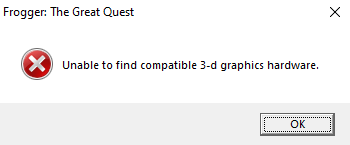
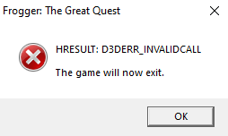

# Fixing the PC Port of Frogger: The Great Quest
The PC port of Frogger: The Great Quest has many issues relating to the framerate including crashes.

**IMPORTANT:** Some of these steps will need to be done every time you reboot your computer or shut down the relevant programs.  
Follow the check-list at the bottom of the file if you are not sure if you have followed the steps correctly.

## Step 1) DxWnd
DxWnd is a program used to fix old games to run properly on modern versions of Windows.
It is used to fix some of the problems with the game.

**a) Download DxWnd**  
Create a folder called "DxWnd" somewhere memorable. (If you are following the modding guide, create this folder in `<root folder>\PC`)  
Download DxWnd [here](https://sourceforge.net/projects/dxwnd/), and extract it into the DxWnd folder.  

**b) Setup DxWnd**
After opening `DxWnd.exe`, drag and drop `GreatQuest.exe` into DxWnd.  
Luckily, DxWnd fixes most of the game issues with its default settings, and even runs the game in a window.  

To fix the text displaying at wrong places:
- Main > Force Windowing > Make sure the checkbox is checked.
- Video > Screen Resolution > Set to SD+HD (Makes the game render at a higher resolution)

But in order to make the game not listen to keyboard input while it's not in focus, change the following settings:
- Input > Suspend GetAsyncKeyState > Make sure the checkbox is checked.
- Input > Hook dinput > Make sure the checkbox is checked.

**c) Save your changes**
DxWnd does not auto-save, so after making your changes make sure to save them from the main menu with `File > Save`.  

**d) Important!**  
DxWnd must be running for it to work. This means if you close DxWnd or restart your computer, it will no longer be active.  
So make sure DxWnd is running before starting the game.  

## Step 2) RivaTuner
Unfortunately, DxWnd doesn't seem to be able to properly cap the game's frame-rate to 60 FPS.  
Many issues can occur such as excessively high/low jumps, goobers getting stuck midair, excessive crashing, etc.  
RivaTuner is the best program we've found for clamping the frame-rate, and it even comes with a nice on-screen FPS indicator.  

**a) Install RivaTuner**
Download RivaTuner [here](https://www.guru3d.com/download/rtss-rivatuner-statistics-server-download/) and install it.  
Be careful not to download it from other sources that pretend to be official but contain malware.  

**b) Configure RivaTuner for Great Quest**  
When opening RivaTuner, the RivaTuner window may be hidden. If so, it can be opened from the icon drawer on the Windows taskbar.  
Click the green "Add" button to add `GreatQuest.exe` to RivaTuner.  
Then, set the `Framerate limit` to 60.  

**c) Try running the game**
If RivaTuner has been successfully setup, the framerate will be drawn to the screen in large orange text while the game is running.  

**IMPORTANT:** Just like DxWnd, if RivaTuner is closed, it will stop working.  
So if the orange frame-rate counter isn't seen when launching the game, make sure RivaTuner is actually running.  
Also, if the frame-rate counter is shown, but above 60FPS, make sure 

## Troubleshooting
### The game runs full-screen!
Make sure DxWnd is open and running.
If DxWnd is open, but does not have the `GreatQuest.exe` icon within its main menu, follow the steps for DxWnd again
On rare occasions, DxWnd may not successfully run the game in a window, so try closing and re-opening the game.

### The game is running, and the orange RivaTuner frame-rate counter is shown, but it's above 60 FPS.
RivaTuner forgot the frame-rate limit.  
Open up RivaTuner, and set `GreatQuest.exe`'s framerate limiter to 60.  
Sometimes it may say 60, but still need to be changed to 59 and then back to 60 before it works.  

### The game crashes frequently or has more bugs than usual.
Make sure both DxWnd and RivaTuner are currently running, not just setup properly.  

### The game crashes often on the main menu.  
This is normal, and we have not yet determined the cause of this crash.  

### "Unable to find compatible 3-d graphics hardware."

**This issue was solved by using DxWnd.**  

However, despite the game running, I am very skeptical about this fix.  
It was determined that `D3D9DeviceEx::ResetSwapChain` was getting called with a resolution of `60x22` and an invalid video mode of `72047056`.  
The real resolution should be `640x480`, and a video mode of `D3D9Format::X8R8G8B8`.  
This makes me think that whatever is going wrong is some kind of memory corruption, and because I'm not sure how DxWnd fixes it, I suspect the memory corruption 
This issue happened on a PC with the exact same GPU/GPU driver version as a PC that did not have the issue, so that is 100% confirmed to not be the issue.  
