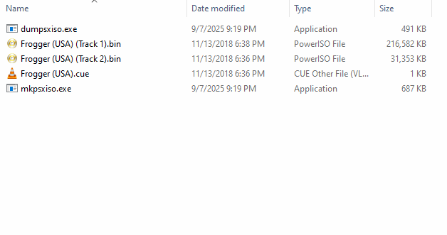
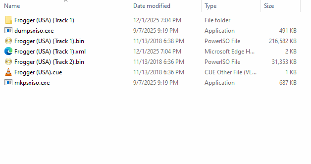

# How to create/install PlayStation (PSX) Mods with FrogLord
The following guide explains how to create modifications to FrogLord's supported PlayStation release.

# General Guide
> [!NOTE]
> The steps here are also valid for PlayStation games other than ones supported by FrogLord.

## Step #1) Download [mkpsxiso](https://github.com/Lameguy64/mkpsxiso).
The tools downloaded here are for working with `.bin/.cue` PlayStation CD images.  
Or more specifically, just the `.bin` files, which contain all the data on a CD.  
Make sure you have the PSX CD image for the game you're looking to mod.  

> [!NOTE]  
> If your PSX CD image has multiple `.bin` files, use only the first track with this guide.  
> No games currently supported by FrogLord use anything besides Track 1, so other tracks can be ignored.  
> If you have very many tracks (such as 32 tracks), double-check that the CD image you have is actually a PSX game, and not a PC game.

> [!IMPORTANT]  
> By default, Windows will hide common file types like `.txt`, `.exe`, etc.  
> If your file names look like `Frogger` instead of `Frogger.exe`, you will need to disable that feature.  
> To do so, search for `File Explorer Options` in the Windows/Start menu, then navigate to the `View` tab.  
> Make sure the `Hide extensions for known file types` checkbox is **NOT** ticked.

## Step #2) Extracting the CD Image
The program called `dumpsxiso` is the tool which will extract all files/data from the `.bin` file into a folder.  
It will also create a special template (`.xml` file) which describes how to recreate the original CD image from the file folder.  

To use `dumpsxiso`, drag-and-drop your `Frogger.bin` file onto `dumpsxiso` in Windows explorer.  
A black window will pop up for a few seconds, and then the files inside of `Frogger.bin` will be extracted.  

> [!NOTE]
> Technically-savvy users may instead prefer to run `dumpsxiso` as a command-line application.  

> [!NOTE]
> **Q:** Why do we use `dumpsxiso` instead of regular ISO software?  
> **A:** Because most software can't dump `.STR` and `.XA` files correctly.  
> Also, no other software will make the `.xml` file that `mkpsxiso` needs.  

## Step #3) Making Changes
Now that you have the files from the CD image, to install a mod, you'll want to apply changes to those files.  
This is where FrogLord comes in. FrogLord can open these files, make changes/install mods, then save new versions of the files.  

Open FrogLord, and show it where to find the game files located in the previously created CD image folder.  
After FrogLord successfully loads the game files, follow the mod's included installation instructions.  

Once your mod has been setup in FrogLord, press `Ctrl + S` or go to the `File > Save` menu in FrogLord.  
For Frogger (USA), there are two files which need to be replaced, `FROGPSX.MWD` and `SLUS_005.06`.  
FrogLord will save these files as `modded_FROGPSX.MWD` and `modded_SLUS_005.06`.  
Rename `SLUS_005.06` to `original_SLUS_005.06`, and then rename `modded_SLUS_005.06` to `SLUS_005.06`.  
Rename `FROGPSX.MWD` to `original_FROGPSX.MWD`, and then rename `modded_FROGPSX.MWD` to `FROGPSX.MWD`.  
While keeping the originals as copies isn't required, it is a very good idea.
It means you'll always have a clean version to install other mods with.  

> [!NOTE]  
> The file `modded_FROGPSX.MWI` can be ignored in this guide.  
> This file is only used by mods that require compiling the source code, which follows a different guide. <!-- TODO: Link guide once it exists. -->  

> [!WARNING]  
> If the file `modded_FROGGER.EXE` is seen, instead of `modded_SLUS_005.06`, this means you've accidentally opened a PC version of the game in FrogLord, instead of the PSX version.  
> In FrogLord, open the files `SLUS_005.06` and `FROGPSX.MWD` from the CD image folder created previously in step 2.  

## Step #4) Making a new CD Image
Now it's time to make a new CD image from the modified files.  

To use `mkpsxiso`, drag-and-drop the previously created `Frogger.xml` file onto `mkpsxiso` in Windows explorer.  
A black window will pop up for a few seconds, and then `mkpsxiso.bin`/`mkpsxiso.cue` will be created.  

That's all! `mkpsxiso.bin` can now be played like any other PSX CD image, either in an emulator or real hardware.  

> [!NOTE]  
> Technically-savvy users may instead prefer to run `mkpsxiso` as a command-line application.

# With Source Code Changes (Frogger Only)
This section is not important until mods are created which utilize the source code.  
Frogger has its full PlayStation source code available, which has its own simplified setup for making Frogger PSX CD images.  
First, follow the instructions found in [the repository](https://github.com/HighwayFrogs/frogger-psx) to setup the source code.  
Next, save your mod with FrogLord.  
Replace `merge\FROGPSX.MWI` with FrogLord's newly saved `FROGPSX-MODIFIED.MWI`, and `build\NTSC-U (USA)\files\FROGPSX.MWD` with FrogLord's newly saved `FROGPSX-MODIFIED.MWD`.  
Next, run `clean.bat` (otherwise the .MWI won't update), and then `compile.bat`.
Upon completion, you will be asked if you'd like to create a new PSX CD image, and if so, the script will guild you through the rest.  
